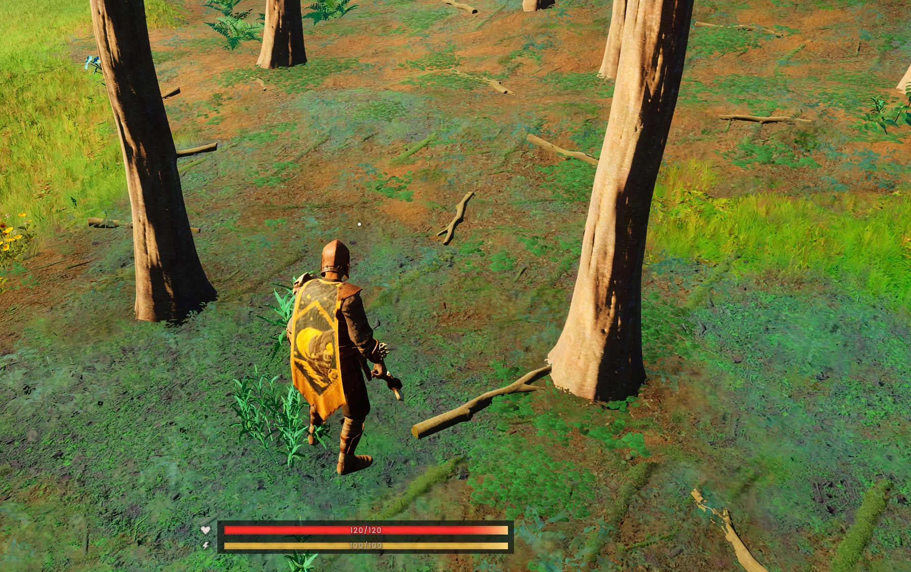

## Tested Environment

- ✅ Tested in **Single Player** only.
- ⚠️ Multiplayer compatibility has not been tested.

# DragonWildsAutoPickup

A lightweight Quality-of-Life mod for **RuneScape: Dragonwilds** using **UE4SS**.

> ⭐ Recommended: Press **F9** near dropped items for the smoothest experience.
>
> ⚠️ **F8 Auto Pickup is experimental and may cause performance stuttering.**

---

## Screenshot

## Requirements

- **UE4SS**
  - Download the latest release from
    https://github.com/UE4SS-RE/RE-UE4SS/releases
  - Recommended file:
    **zDEV-UE4SS_v3.0.1-1009-gc2ac2464.zip**

#Installation

1. Install UE4SS.
2. Download this repository as ZIP.
3. Extract the DragonWildsAutoPickup folder.
4. Copy it to:

Binaries\Win64\ue4ss\Mods\

5. Launch the game.
6. Press F9 near dropped items.

## Why F9?

F9 performs a one-time scan only when requested.

This avoids continuous scanning and provides much smoother gameplay than experimental automatic pickup.

## Features

- ✅ Manual Pickup (Recommended) - **F9**
- ⚠️ Auto Pickup (Experimental) - **F8**
- UE4SS Lua only
- No original game files are modified.
- Open Source

## Controls

| Key | Function |
|------|----------|
| F9 | Manual Pickup (Recommended) |
| F8 | Auto Pickup (Experimental) |

## Recommendation

**F9 is the recommended way to use this mod.**

Press **F9** while standing near dropped items.

Although **F8** provides continuous automatic pickup, it may cause noticeable stuttering depending on your PC and the number of nearby items.

## Disclaimer

This project does **not** modify any original game files.

This is an unofficial community Quality-of-Life mod and is **not affiliated with Jagex**.

## License

MIT License
